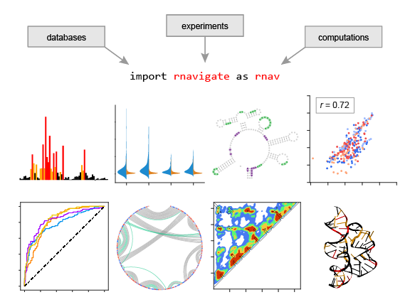

Welcome to RNAvigate docs!
==========================



[Github](https://github.com/Weeks-UNC/RNAvigate) | [Publications](publications.md)

- [What is it and who is it for?](#what-is-it-and-who-is-it-for)
- [What problem does it solve?](#what-problem-does-it-solve)
- [Workflow overview](#workflow-overview)
- [Questions, requests, and issues](#questions-requests-and-issues)

Getting started

1. [Installing RNAvigate](installing-rnavigate.md)
2. [Loading data files](loading-data.md)
3. [Visualizing data](visualizing-data.md)


## What is it and who is it for?

RNAvigate is a plotting and analysis framework built for RNA bench scientists.
It is a Python library, but it is designed to be very simple to use and learn,
while providing useful tools, common analyses and visualizations for the
RNA structure community. It provides an interface for exploratory data analysis
within Jupyter Notebooks or python scripts. Knowledge of python or command line
tools is not necessary.

## What problem does it solve?

Tools and scripts exist to analyze RNA structure data via the command line or
through GUI interfaces. These types of tools are generally not well suited for
rapid data exploration because of the additional overhead of managing and
organizing intermediate data files, or of clicking through to reproduce an
analysis.

Interactive programming with Jupyter notebooks offers an elegant solution to
this problem and many, if not most, data scientists utilize these notebooks for
reproducible data exploration, analysis, and figure creation. However, these
notebooks require fluency in data science programming. RNAvigate solves this by
providing a simple to understand interface that implements many of the common
analyses and visualizations utilized by the RNA structure community.

## Workflow overview

1) Search databases or perform experiments and data pre-processing to
   obtain data file inputs for RNAvigate.

2) Create an `rnavigate.Sample` and load data by assigning file names to
   **data keywords**.

```python
import rnavigate as rnav

sample_name = rnav.Sample(
    data_keyword="input_file.txt",
)
```

3) Create `rnavigate.plots` by providing `rnavigate.Sample` names and
   **data keywords** to plotting functions.

```python
rnav.plotting_function(
    samples=[sample_name],
    plotting_keyword="data_keyword",
)
```

## Questions, requests, and issues

Use [GitHub issues](https://github.com/Weeks-UNC/RNAvigate/issues) to request
new features, to report bugs or unexpected behavior, or to ask questions. This
feedback is very useful for improving RNAvigate for everybody!

In most cases, RNAvigate can be efficiently expanded to accept new data file
formats. Reach out using the issues link above to request support for a new
format or a new visual language (like the red, orange, black, grey default
for SHAPE-MaP), submit a GitHub issue with an example file and/or example visualization. For more information on the broad categories of data that
RNAvigate is well-suited for see [data types](data-types.md).

## Developers

Please [contact me](mailto:psirving@email.unc.edu) if you are interested in
helping to improve RNAvigate or in using RNAvigate in your own projects.

These developer resources are works-in-progress.
- [Full API](full_api_index.md)
- [Developer's style guide](dev_style_guide.md)
